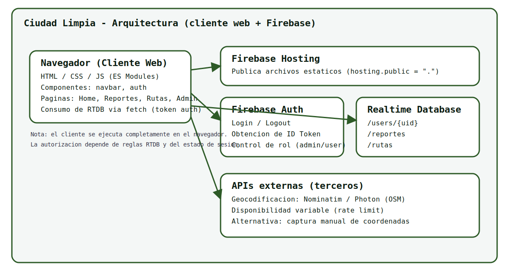
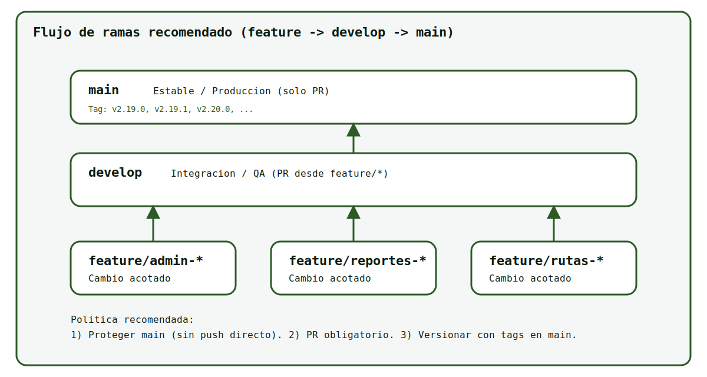
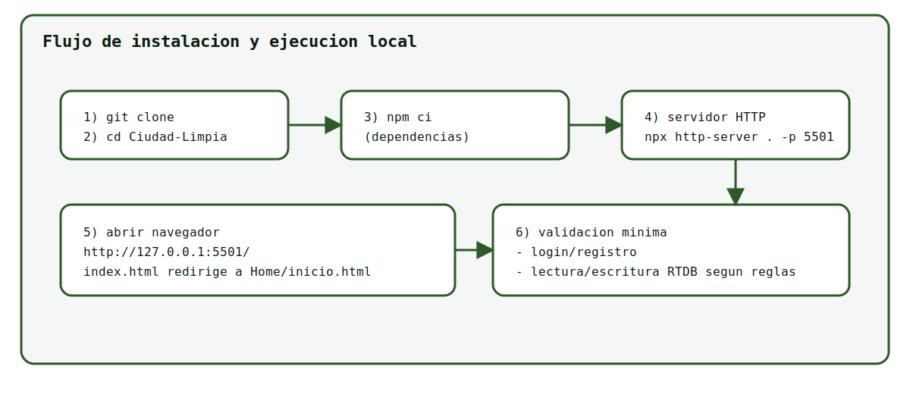
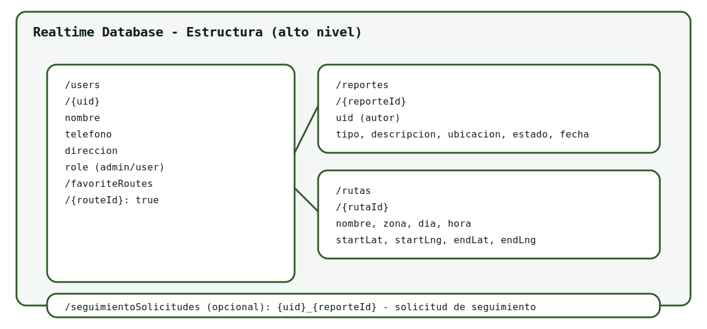
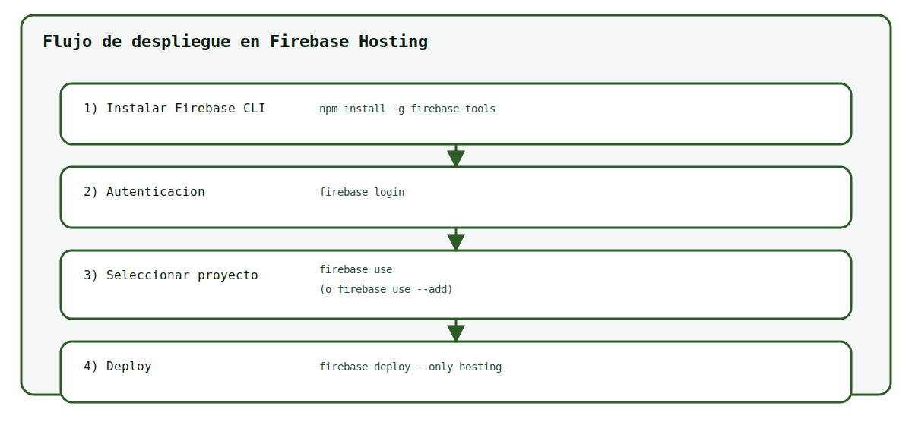

# Guia de instalacion y despliegue (Ciudad Limpia)

Version de referencia: **v2.19.0**

Repositorio: `https://github.com/AngelSalaz/Ciudad-Limpia.git`

## 1. Objetivo
Establecer un procedimiento **completo, formal y reproducible** para:

1. Obtener el codigo desde GitHub.
1. Preparar el entorno de ejecucion local.
1. Validar el funcionamiento base (login, lectura/escritura).
1. Desplegar el sistema en Firebase Hosting.
1. Documentar fallas comunes, causas probables y correcciones.

## 2. Arquitectura (vista general)
El sistema se ejecuta como sitio estatico (HTML/CSS/JS en navegador) y consume servicios de Firebase.

Imagen: arquitectura general.



Servicios involucrados:

- **Firebase Hosting**: publica archivos estaticos.
- **Firebase Authentication**: gestion de sesiones.
- **Firebase Realtime Database (RTDB)**: persistencia de usuarios, reportes, rutas y solicitudes.
- **APIs externas (geocodificacion)**: para convertir direccion a coordenadas (ej. Nominatim/Photon). Su disponibilidad depende de terceros.

## 3. Requisitos previos

### 3.1. Software local

1. Git (obligatorio)
   - Verificacion:
     - `git --version`
1. Node.js + npm (recomendado)
   - Verificacion:
     - `node -v`
     - `npm -v`
1. Servidor HTTP local (obligatorio)
   - No se debe abrir el proyecto con `file://` porque los modulos ES y/o requests pueden fallar por politicas del navegador.

### 3.2. Accesos

1. Acceso al repositorio GitHub.
1. Acceso al proyecto Firebase (o credenciales para crear uno nuevo).

## 4. Obtencion del codigo desde GitHub

### 4.1. Clonar repositorio

En una terminal:

```powershell
git clone https://github.com/AngelSalaz/Ciudad-Limpia.git
cd Ciudad-Limpia
```

Evidencia recomendada: captura del comando y carpeta clonada.

### 4.2. Flujo de ramas (obligatorio para el equipo)

Se recomienda un esquema tipo GitFlow ligero:

- `main`: rama estable (solo por Pull Request).
- `develop`: rama de integracion.
- `feature/*`: desarrollo por modulo/tarea.

Imagen: flujo de ramas recomendado.



Comandos base para una tarea:

```powershell
git switch develop
git pull

git switch -c feature/<modulo>-<tarea>
# cambios...
git add -A
git commit -m "Mensaje en espanol"
git push -u origin feature/<modulo>-<tarea>
```

## 5. Instalacion local

### 5.1. Instalacion de dependencias

Este proyecto se comporta como sitio estatico, pero mantiene dependencias (por ejemplo, `firebase`) para consistencia.

En la raiz del proyecto:

```powershell
npm ci
```

Nota: si no existe `package-lock.json`, usar `npm install` (en este repositorio si existe).

### 5.2. Levantar servidor local

Opcion A (VS Code): Live Server sobre `index.html`.

Opcion B (terminal):

```powershell
npx http-server . -p 5501 -c-1
```

Abrir en navegador:

```text
http://127.0.0.1:5501/
```

Imagen: flujo de ejecucion local.



## 6. Configuracion de Firebase (cliente + consola)

### 6.1. Configuracion del cliente
Archivo: `firebase-config.js`

Campos requeridos:

- `apiKey`
- `authDomain`
- `databaseURL`
- `projectId`
- `storageBucket`
- `messagingSenderId`
- `appId`

Importante:
- `databaseURL` debe apuntar a tu RTDB y coincidir con el proyecto en Firebase Console.

### 6.2. Authentication
En Firebase Console:

1. Authentication -> Sign-in method
1. Habilitar proveedor (por ejemplo Email/Password)
1. Confirmar dominios autorizados para el hosting (si aplica)

### 6.3. Realtime Database (RTDB)
Estructura de datos usada por el proyecto (alto nivel):



Rutas principales:

- `/users/{uid}`
- `/reportes`
- `/rutas`
- `/seguimientoSolicitudes`

Reglas (principio):
- Deben permitir lectura/escritura segun el rol y los casos de uso.
- Si el rol se almacena en RTDB, considerar que las reglas deben validarlo de forma consistente con el flujo del sistema.

## 7. Despliegue (Firebase Hosting)

### 7.1. Requisitos

1. Instalar Firebase CLI:

```powershell
npm install -g firebase-tools
firebase --version
```

2. Login:

```powershell
firebase login
```

3. Seleccion de proyecto:

```powershell
firebase use
```

Si se requiere asociar un proyecto distinto:

```powershell
firebase use --add
```

### 7.2. Configuracion de hosting
Archivo: `firebase.json`

- `hosting.public`: `.` (publica la raiz del repositorio)
- `hosting.ignore`: excluye `node_modules`, `docs`, `scripts`, etc.

### 7.3. Deploy

```powershell
firebase deploy --only hosting
```

Imagen: flujo de despliegue.



Validacion post-deploy:

1. Abrir la URL `https://<proyecto>.web.app`
1. Verificar redireccion desde `index.html` hacia `Home/inicio.html`
1. Probar login/registro
1. Verificar que se lean/escriban datos en RTDB conforme a reglas

## 8. Errores comunes y solucion

### 8.1. GitHub (red / autenticacion)

**Sintoma**
- `Failed to connect to github.com port 443`

**Causa probable**
- Bloqueo por red, firewall, proxy o DNS.

**Solucion**
- Probar otra red.
- Configurar proxy de Git si aplica.
- Verificar acceso a GitHub desde el navegador.

### 8.2. Abrir con file://

**Sintoma**
- Imports ES module fallan, CORS, o no se cargan scripts.

**Causa probable**
- Navegador bloquea recursos cuando se abre un archivo directamente.

**Solucion**
- Usar Live Server o `http-server` (seccion 5.2).

### 8.3. RTDB PERMISSION_DENIED

**Sintoma**
- Respuestas vacias, errores en consola, `PERMISSION_DENIED`.

**Causa probable**
- Reglas RTDB no permiten la operacion.
- Usuario no autenticado.
- Estructura de datos no coincide con la esperada.

**Solucion**
- Confirmar sesion activa.
- Verificar reglas RTDB.
- Verificar que existan nodos `/users`, `/reportes`, `/rutas`.

### 8.4. Hosting deploy falla

**Sintoma**
- `Permission denied` o proyecto incorrecto.

**Causa probable**
- No se ejecuto `firebase login`.
- Usuario sin permisos en Firebase.
- Proyecto no seleccionado.

**Solucion**
- `firebase login`
- `firebase use`
- Solicitar permisos (Editor/Owner).

### 8.5. Geocodificacion no encuentra direccion

**Sintoma**
- Mensaje: "no se encontraron resultados".

**Causa probable**
- Direccion no existe en el proveedor OSM/Nominatim.
- Faltan datos (numero, tipo de via, CP/colonia).
- Limitacion por rate-limit de terceros.

**Solucion**
- Incluir tipo de via y numero (ej. "Calle X 123").
- Incluir CP/colonia en los campos correspondientes.
- Esperar 10-20s y reintentar si hay rate-limit.
- Ingresar coordenadas manualmente como alternativa.

## 9. Evidencias requeridas (imagenes)
Para documentacion formal con evidencia, usar la plantilla:

- `docs/instalacion/PLANTILLA_CAPTURAS.md`

