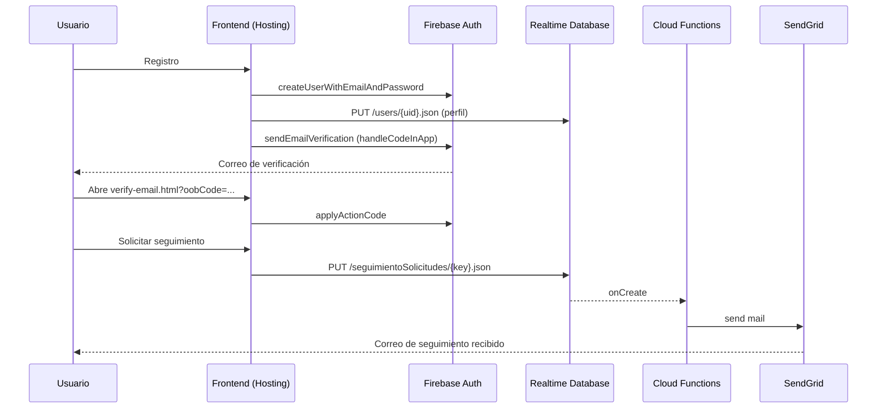

# Notificaciones por Correo (SendGrid + Firebase Auth)

## 1. Objetivo

Implementar notificaciones por correo para:

- **Seguridad**: verificación del correo al registrarse.
- **Recuperación de contraseña**: envío de enlace para restablecimiento.
- **Seguimiento de reportes**: confirmación de solicitud de seguimiento.
- **Actualización de estado**: aviso cuando cambia el estado de un reporte.

## 2. Verificación de correo (Firebase Auth)

### Flujo

1. Registro (`Login/Registro/registro.js`):
   - Crea usuario con `createUserWithEmailAndPassword`.
   - Guarda temporalmente el perfil (localStorage) y **no crea** `/users/{uid}` hasta que el correo esté verificado.
   - Envía correo de verificación con `sendEmailVerification` y `handleCodeInApp: true`.
   - Cierra sesión y redirige a Login.
2. Verificación (`Login/verify-email.html` + `Login/verify-email.js`):
   - Lee `oobCode` del querystring.
   - Aplica el código con `applyActionCode`.
3. Login (`Login/login.js`):
   - Si `emailVerified === false`, bloquea el inicio de sesión y reenvía verificación.
   - Si `emailVerified === true`, crea `/users/{uid}` si no existe (migrando el perfil temporal si está disponible).

### Notas de implementación

- La URL de acción se genera con base en el `projectId`:
  - `https://<projectId>.web.app/Login/verify-email.html`
- La página de verificación debe permanecer desplegada en Hosting y accesible.

## 3. Recuperación de contraseña (Firebase Auth)

### Flujo

1. Login (`Login/login.js`):
   - Botón "¿Olvidaste tu contraseña?"
   - Envía `sendPasswordResetEmail` usando el **flujo oficial de Firebase** (para evitar “doble formulario”).
   - Al finalizar el restablecimiento, Firebase regresa a:
     - `https://<projectId>.web.app/Login/login.html?reset=1`

> Nota: existe una implementación de UI propia (`Login/reset-password.html`), pero en despliegues escolares
> y sin backend se prefiere el flujo oficial de Firebase por estabilidad y menor confusión en el usuario.

## 4. Seguimiento y estado del reporte (SendGrid en Cloud Functions)

### 4.1 Solicitud de seguimiento (trigger RTDB)

- Origen: el usuario crea una solicitud en:
  - `/seguimientoSolicitudes/{key}`
  - En el frontend se usa el patrón `{uid}_{reporteId}` en `Usuarios/Usuarios-perfil.js`.
- Trigger: `functions/index.js` (`onSeguimientoSolicitado`):
  - Evento: `onCreate`.
  - Destino: `usuarioEmail`.
  - Contenido: folio y texto de solicitud.

### 4.2 Cambio de estado del reporte (trigger RTDB)

- Origen: cuando un admin actualiza el estado de un reporte en:
  - `/reportes/{reporteId}`
- Trigger: `functions/index.js` (`onReporteActualizado`):
  - Evento: `onUpdate`.
  - Condición: solo envía correo si el campo `estado` cambió.
  - Destino: `usuarioEmail` del reporte.

## 5. Configuración de SendGrid

### Variables (recomendado)

- `SENDGRID_API_KEY`
- `SENDER_EMAIL` (ej. `ciudadlimpiadgo@gmail.com`, requiere verificación en SendGrid)
- `SENDER_NAME` (ej. `Ciudad Limpia`)

### Consideraciones

- El remitente **debe estar verificado** en SendGrid (Single Sender o dominio).
- La API Key se debe tratar como secreto (no exponer en frontend).

## 6. Diagrama (resumen)

